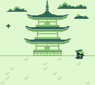

# gb_jutsu

Working title for a homebrew Gameboy game.

Play as a mysterious samurai and slash the shurikens away from your pagoda!

## Screenshots

## Generate Your Own:

#### Windows: 

Execute the `make.bat`, then load into your favorite GB emulator ([BGB](https://bgb.bircd.org/) is preferred).

## Tooling

* [gbdk-2020](https://github.com/Zal0/gbdk-2020) - GameBoy Development Kit - A C library for homebrew game development
* [GBTD](http://www.devrs.com/gb/hmgd/gbtd.html) - GameBoy Tile Designer
* [GBSoundDemo](https://github.com/Zal0/GBSoundDemo) - A replacement for the broken `sound` example in GBDK
* [Beepbox](https://www.beepbox.co/) - Simple chiptune sound designer

## Contact

Tyler Porter

tyler.b.porter@gmail.com
